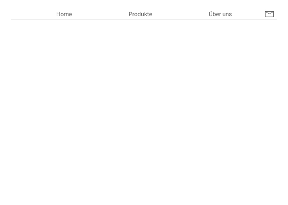
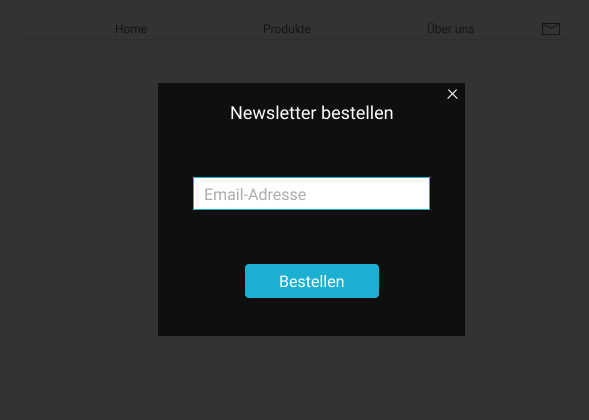
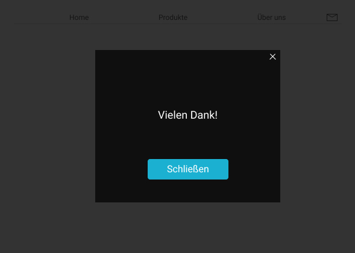

# Newsletter-Overlay

- Bei Klick auf das Brief-Icon soll ein Overlay dargestellt werden, das die ganze Seite bedeckt
- Schreib das JavaScript für das Anzeigen und Ausblenden des Overlays ohne Bootstrap-JavaScript zu benutzen
- Nachdem das Email-Feld ausgefüllt und der Bestellen-Button gedrückt wurde, soll das Overlay nicht verschwinden sondern eine Danke-Meldung im selben Overlay angezeigt werden

## Schließen des Overlays
- Das Overlay kann über den X-Button geschlossen werden und über den Schließen-Button nach Abschicken der Newsletter-Bestellung
- Auch wenn man auf die transparente Fläche des Overlays klickt, soll es geschlossen werden
- Nutze Methoden des Event-Objekts um sicherzustellen, dass Klick-Events aus dem Inneren Teil des Overlays nicht auf den transparenten Teil übertragen werden und es unabsichtlich geschlossen wird

